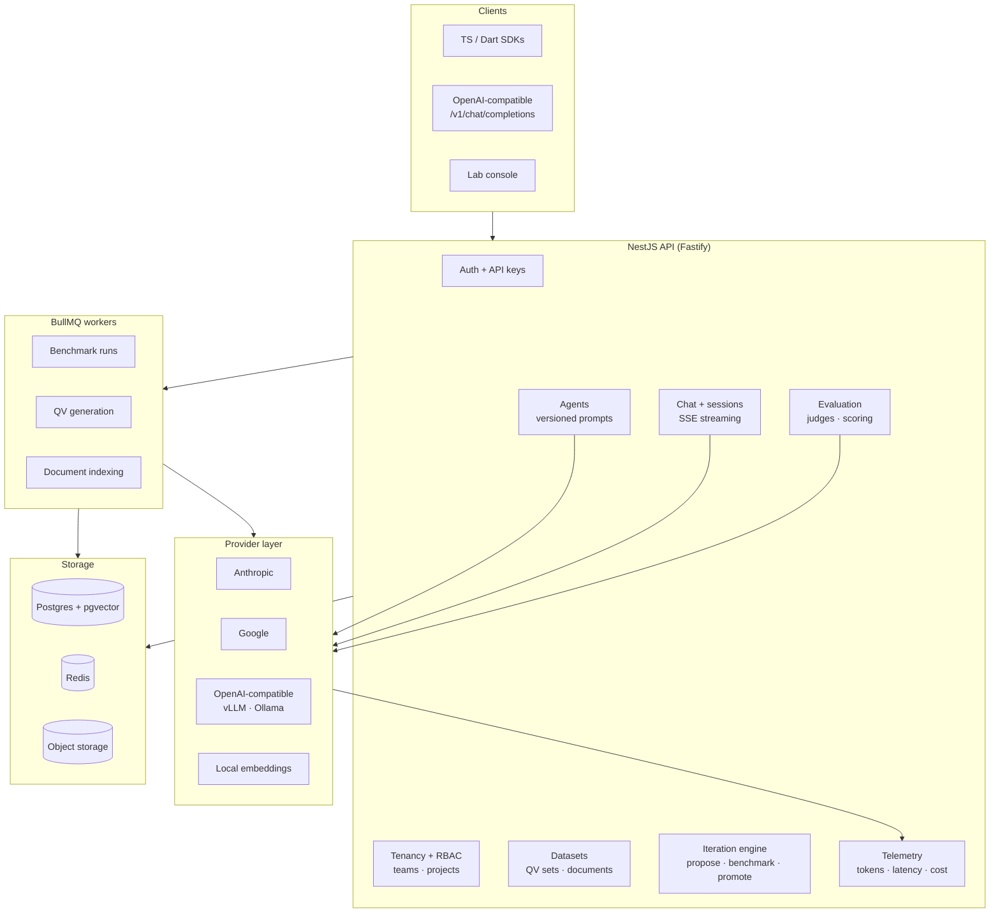

# II LLM Lab

[](#status)
[](https://opensource.org/licenses/Apache-2.0)
[](https://nestjs.com/)
[](https://www.typescriptlang.org/)
[](https://nodejs.org/)

**An evaluation-driven lab for LLM agents.** Define an agent, define what "correct"
means for it, and let the platform iterate the prompt until the numbers move — with
every run costed, versioned, and reproducible.

> ### Status
>
> **This repository is a preview.** There is no runnable code here yet — this README is
> the architecture spec the implementation will be built against. It documents the
> intended design, not shipped behavior. Follow or watch the repo for the first release.

---

## Why

Most prompt work is a person editing a string, eyeballing three outputs, and shipping.
That does not survive a model upgrade, a new provider, or a second engineer.

II LLM Lab treats a prompt as an artifact under test:

1. **Ground truth first.** An agent is paired with a *QV set* — question/validator pairs
   that define correct behavior, authored by hand or generated from your own documents.
2. **Score every version.** Each run produces per-question scores, judge reasoning, human
   overrides, latency, token counts, and cost.
3. **Iterate intelligently.** The platform proposes prompt variants, benchmarks them
   against the same QV set, and surfaces the score delta — so promotion is a decision
   backed by a regression suite, not a hunch.
4. **Ship behind a stable API.** Agents are served over an OpenAI-compatible endpoint, so
   swapping a model or promoting a prompt version never breaks a client.

This continues [Intelligent Iterations](https://github.com/intelligent-iterations)' earlier
LLM Lab — previously a Dart/Firebase service with
[Flutter](https://github.com/intelligent-iterations/llm_lab_sdk_flutter) and
[JS](https://github.com/intelligent-iterations/llm_lab_sdk_js) SDKs — rebuilt on NestJS
with a first-class evaluation and iteration loop.

---

## Architecture



### The iteration loop

```
  QV set  ──►  run agent vN  ──►  judges  ──►  scores + cost + latency
                                                       │
                        promote / rollback  ◄───────────┤
                                                       ▼
                                            propose agent vN+1
                                            (prompt variant)
```

A run is immutable. A promotion is a pointer move. Every agent version keeps the
benchmark that justified it, so "why is the prompt like this?" has an answer.

---

## Module map

The API is a NestJS monolith with hard module boundaries — each module owns its schema
and exposes a service interface, so any of them can be extracted to its own process
without a rewrite.

| Module | Responsibility |
| --- | --- |
| `AuthModule` | Firebase Auth / JWT sessions, hashed API keys, guards, rate limiting |
| `TenancyModule` | Teams, projects, invites, plans; role-based access on every resource |
| `AgentsModule` | Agent CRUD, immutable version history, system prompt, model params, JSON output schema |
| `ProvidersModule` | Provider registry — normalizes chat, streaming, tool use, and usage reporting across vendors |
| `ChatModule` | OpenAI-compatible completions, chat sessions, SSE token streaming, conversation persistence |
| `MemoryModule` | Document ingestion, chunking, embeddings, pgvector retrieval, per-project memory scoping |
| `DatasetsModule` | QV sets (question + validator), imports, and LLM-assisted generation from source documents |
| `EvaluationModule` | Judge strategies, run orchestration, per-question scoring, human score overrides |
| `IterationModule` | Prompt variant proposal, A/B benchmarking against a fixed QV set, promotion and rollback |
| `SimulationModule` | Agent-to-agent conversations — a synthetic user agent probes the tested agent against scoring criteria |
| `TelemetryModule` | Token accounting, latency, cost attribution, benchmark history, per-project usage rollups |
| `QueueModule` | BullMQ producers/consumers for benchmark runs, generation, and indexing |

### Judge strategies

Evaluation is pluggable — a validator declares which judge scores it:

| Judge | Use for |
| --- | --- |
| `exact` / `contains` | Deterministic string expectations |
| `regex` | Format and extraction rules |
| `json-schema` | Structured-output agents — validates shape before content |
| `llm-judge` | Open-ended answers, scored with reasoning attached |
| `embedding` | Semantic similarity against a reference answer |
| `human` | Manual override that supersedes any automatic score |

Human overrides are recorded alongside — never in place of — the automatic score, so
judge accuracy is itself measurable over time.

---

## Data model

```
Team ──┬── Project ──┬── Agent ────── AgentVersion (prompt, model, params, schema)
       │             │                     │
       │             │                     └── BenchmarkRun ── QuestionResult
       │             │                              │              (score, reason,
       │             ├── QVSet ── QV                │               human override)
       │             │   (question, validator)      │
       │             │                              └── RunStats
       │             ├── Document ── Chunk ── Embedding    (tokens, cost, latency, pass)
       │             │
       │             └── ChatSession ── Message
       │
       └── Membership ── User
```

---

## Stack

| Layer | Choice | Why |
| --- | --- | --- |
| Runtime | Node.js 22 LTS, TypeScript 5.7+ | Long-term support, native ESM |
| Framework | NestJS 12 on Fastify | DI and module boundaries that survive growth; Fastify for streaming throughput |
| Validation | Zod 4 + `nestjs-zod` | One schema drives DTO validation, OpenAPI, and SDK types |
| Persistence | Postgres 17 + Drizzle ORM | Typed SQL, explicit migrations |
| Vectors | pgvector | Retrieval next to relational data — no second datastore to operate |
| Queue | BullMQ on Redis | Benchmark runs are long, retryable, and observable |
| Streaming | SSE | Matches the OpenAI wire format clients already speak |
| API contract | OpenAPI 3.1 via `@nestjs/swagger` | SDKs generated, not hand-written |
| Testing | Vitest + Testcontainers | Real Postgres and Redis in integration tests |
| Delivery | Docker, GitHub Actions | Reproducible builds |

### Provider SDKs

Providers sit behind one internal interface, so an agent's model is configuration, not code.

| Provider | SDK | Models |
| --- | --- | --- |
| Anthropic | `@anthropic-ai/sdk` | `claude-opus-5`, `claude-sonnet-5`, `claude-haiku-4-5` |
| Google | `@google/genai` | `gemini-3-flash`, `gemini-2.5-flash-lite` |
| OpenAI-compatible | `openai` | Self-hosted vLLM, Ollama, and any compatible gateway |
| Embeddings | `@huggingface/transformers` | `all-MiniLM-L6-v2`, run locally — no per-call cost on indexing |

Cost and token rates are resolved from a configurable pricing table at runtime rather than
hardcoded, so a provider price change is a config update, not a release.

---

## Planned API surface

```http
POST   /v1/chat/completions          # OpenAI-compatible; model = agent id, supports stream
GET    /v1/agents/:id/versions       # immutable prompt history
POST   /v1/agents/:id/versions       # draft a new version
POST   /v1/qv-sets                   # define ground truth
POST   /v1/qv-sets/:id/generate      # generate questions from project documents
POST   /v1/runs                      # benchmark an agent version against a QV set
GET    /v1/runs/:id                  # scores, reasons, tokens, latency, cost
POST   /v1/runs/:id/scores           # human override on a question result
POST   /v1/iterations                # propose + benchmark prompt variants
POST   /v1/agents/:id/promote        # move the served pointer to a version
GET    /v1/usage                     # per-project token and cost rollups
```

---

## Roadmap

- [ ] **M1 — Core** · NestJS skeleton, auth + API keys, tenancy/RBAC, agent versioning
- [ ] **M2 — Serving** · Provider layer, OpenAI-compatible endpoint, SSE streaming, chat sessions
- [ ] **M3 — Ground truth** · Documents, chunking, pgvector retrieval, QV sets, generation
- [ ] **M4 — Evaluation** · Judge strategies, benchmark runs on BullMQ, scoring + human overrides
- [ ] **M5 — Iteration** · Variant proposal, A/B benchmarking, promotion and rollback
- [ ] **M6 — Simulation** · Agent-to-agent conversation testing with scoring criteria
- [ ] **M7 — Surface** · Generated TypeScript SDK, refreshed Dart SDK, lab console

---

## License

[Apache License 2.0](LICENSE)
